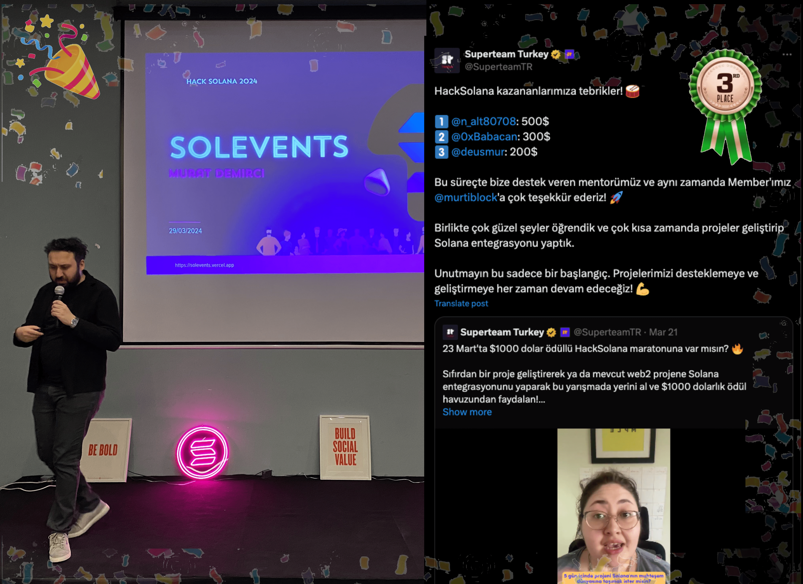

# Project Name: Solevents

This is a simple React project set up with Vite. It uses React 18.2.0, React Router Dom for routing, and React Icons for icon components. The project is configured to use ESLint for linting.

# About This Project:

The Solevents project takes its name from 'Solana events'. The purpose of this project is to gather the Solana user community under a single website. Only individuals with Solana in their wallets can access this app.

# Update - 26 April 20:00

I finished the HackSolana hackathon organized by SuperTeam in 3rd place. I'd like to thank everyone involved; it was a fantastic event :) hashtag#hacksolana

## Getting Started

First, clone the repository and navigate into the project directory.

## Available Scripts

In the project directory, you can run:

- `npm run dev`: Runs the app in the development mode. Open http://localhost:3000 to view it in the browser.
- `npm run build`: Builds the app for production to the build folder.
- `npm run lint`: Runs ESLint to check for linting errors.
- `npm run preview`: Runs a local server for previewing the production build.

## Dependencies

- `dotenv`: A zero-dependency module that loads environment variables from a .env file into process.env.
- `react`: A JavaScript library for building user interfaces.
- `react-dom`: Serves as the entry point to the DOM and server renderers for React.
- `react-icons`: Include popular icons in your React projects.
- `react-router-dom`: DOM bindings for React Router.

## Dev Dependencies

- `@types/react`: TypeScript definitions for React.
- `@types/react-dom`: TypeScript definitions for React DOM.
- `@vitejs/plugin-react`: Vite plugin for React.
- `eslint`: A tool for identifying and reporting on patterns found in ECMAScript/JavaScript code.
- `eslint-plugin-react`: React specific linting rules for ESLint.
- `eslint-plugin-react-hooks`: ESLint rules for React Hooks.
- `eslint-plugin-react-refresh`: ESLint plugin for React Refresh.
- `vite`: A build tool that aims to provide a faster and leaner development experience for modern web projects.
